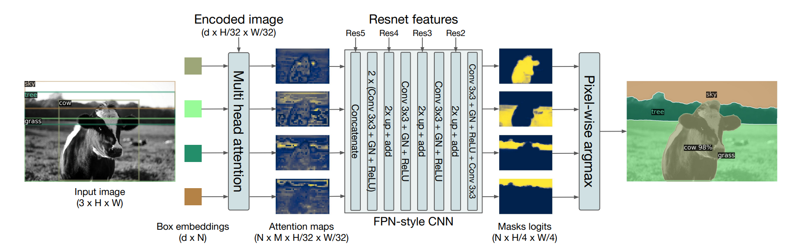
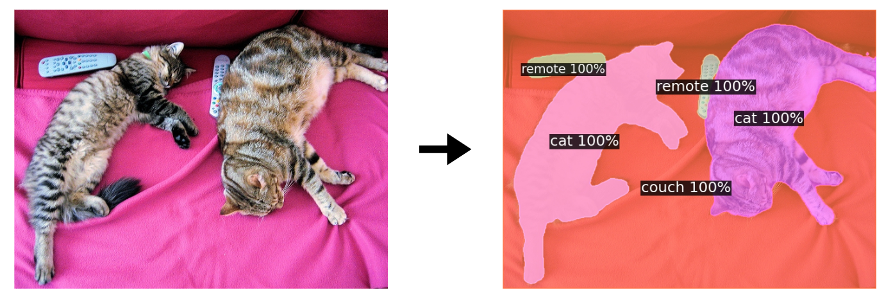
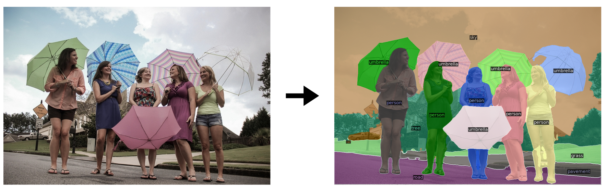

# DETR-ResNet-101: Un Enfoque para la Segmentación Panóptica
Este proyecto es una implementación simplificada del modelo DETR (DEtection TRansformer) propuesto por Facebook AI Research, aplicado específicamente a la tarea de segmentación panóptica.  
Utiliza Streamlit para la visualización interactiva de los resultados y permite probar el modelo de manera local en un entorno aislado.

La aplicación permite cargar una imagen y obtener como salida una segmentación panóptica que combina detección de instancias y segmentación semántica, todo en una sola arquitectura basada en transformers.

## Arquitectura de Segmentación Panóptica con DETR

<p align="center">
  
</p>

La arquitectura utilizada en este proyecto extiende el modelo **DETR (DEtection TRansformer)** para realizar **segmentación panóptica**, combinando detección de objetos y segmentación semántica en una sola estructura unificada. A continuación, se describen brevemente sus componentes principales:

- **Imagen de entrada**: Se ingresa una imagen RGB de dimensiones `[3 × H × W]`.
- **Embeddings de cajas**: Se generan embeddings aprendibles que representan posibles regiones de interés (objetos o áreas).
- **Transformers y atención múltiple (Multi-head Attention)**: Estos embeddings interactúan con la imagen codificada mediante atención, generando mapas que destacan diferentes regiones de la imagen.
- **Backbone FPN-CNN**: Se utilizan características extraídas de varias capas de ResNet (Res2 a Res5), combinadas mediante una red tipo FPN para refinar la segmentación.
- **Máscaras de salida (logits)**: Se generan máscaras binarias para cada región detectada, de tamaño `[N × H/4 × W/4]`.
- **Predicción final (Pixel-wise Argmax)**: Cada píxel es clasificado con una etiqueta única, resultando en una segmentación panóptica completa donde se identifican tanto "cosas" (como vacas) como "stuff" (como cielo o pasto).

Esta arquitectura permite una segmentación precisa y semánticamente rica sin necesidad de postprocesamiento adicional como NMS.

## ¿Qué hace este modelo?
**DETR-ResNet-101 Panoptic** es un modelo basado en *Transformers* que permite:

- Realizar **segmentación panóptica** precisa combinando detección de objetos y segmentación semántica.
- Identificar tanto **cosas** (objetos individuales) como **stuff** (regiones amorfas).
- Generar salidas con **máscaras, clases e instancias únicas** por píxel.
- Usar una arquitectura **end-to-end** sin necesidad de postprocesamiento como NMS.

## 📸 Ejemplos de Segmentación Panóptica

A continuación, se muestran algunos ejemplos del resultado generado por la aplicación. Cada imagen representa una salida panóptica del modelo **DETR-ResNet-101**, combinando detección de instancias y segmentación semántica.

<p align="center">
  
</p>

<p align="center">
  
</p>

Cada región de la imagen está coloreada según la clase identificada, y el modelo asigna un ID único por instancia cuando corresponde.

## Tecnologías Utilizadas

<p align="center">
  
  
  
  
  
</p>

## Despliegue del Proyecto

Sigue estos pasos para ejecutar la aplicación localmente:

### Prerrequisitos
- Git instalado en tu sistema
- Docker instalado y funcionando

1. **Clonar el repositorio**
   ```bash
   git clone https://github.com/sslo12/DETR-Inference-101
   cd DETR-Inference-101
   ```

2. **Construir la imagen Docker**
   ```bash
   docker build -t detr-panoptic .
   ```

3. **Ejecutar el contenedor**
   ```bash
   docker run -p 8501:8501 detr-panoptic
   ```

4. **Acceder a la aplicación**
   
   Abre tu navegador web y visita:
   ```
   http://localhost:8501/
   ```

### Notas Adicionales
- El puerto `8501` es el puerto por defecto de Streamlit
- Asegúrate de que el puerto 8501 esté disponible en tu sistema

## 📁 Estructura del proyecto
```
DETR-Inference-101/
│
├── pages/                             # Scripts para las diferentes secciones de la aplicación
│   ├── about_detr.py                  # Página con información sobre el modelo DETR
│   ├── inference_imgs.py              # Lógica para inferencia en imágenes cargadas
│   ├── panoptic_inference_camera.py   # Inferencia panóptica utilizando la cámara
│   └── panoptic_segmentation.py       # información sobre la segmentación panóptica
│
├── static/                            # Carpeta para archivos estáticos
│
├── .gitignore                         # Archivos y carpetas ignoradas por Git
├── Dockerfile                         # Configuración para contenedor Docker
├── README.md                          # Documentación principal del proyecto 
├── home.py                            # Script de página principal de la aplicación
└── requirements.txt                   # Lista de dependencias del proyecto Python 
```
## Créditos de Desarrollo

Esta implementación fue realizada como una prueba académica de inferencia y visualización del modelo **DETR-ResNet-101** aplicado a la **segmentación panóptica**.  
No somos autores del modelo original, únicamente replicamos su funcionamiento como parte de una actividad de aprendizaje.

**Desarrollado por:**

- María José Clavijo Rojas  
- Shirley Stefany Lombana
- Santiago Valencia
---

## Referencias

Este proyecto está basado en el modelo DETR publicado por Facebook AI Research.

- **Paper:**
  Carion, N., Massa, F., Synnaeve, G., Usunier, N., Kirillov, A., & Zagoruyko, S. (2020). *End-to-End Object Detection with Transformers*. arXiv preprint arXiv:2005.12872. https://doi.org/10.48550/arXiv.2005.12872

- **Repositorio oficial de GitHub:**  
  [https://github.com/facebookresearch/detr](https://github.com/facebookresearch/detr)
